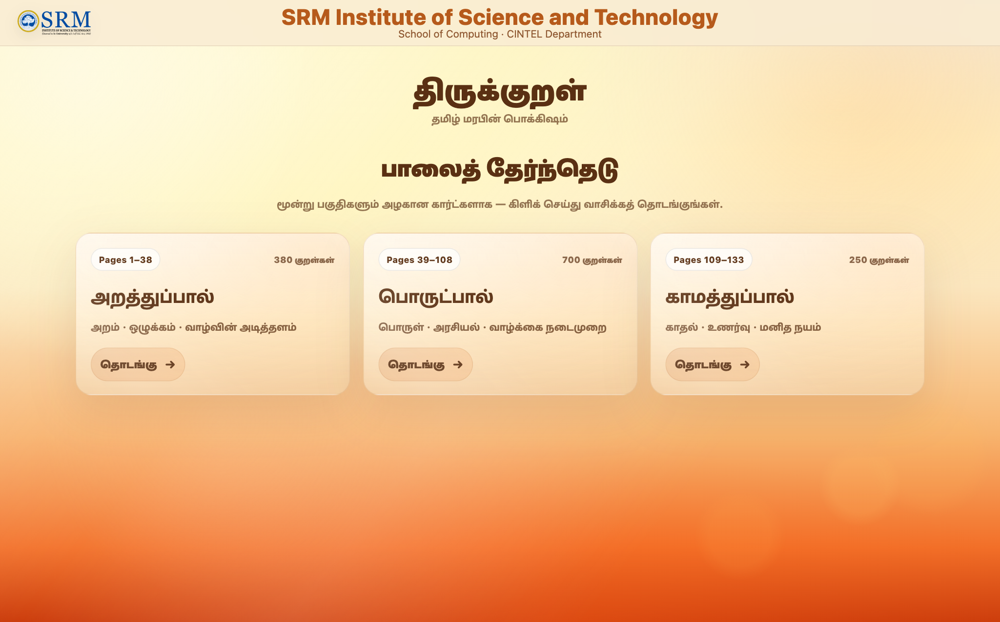
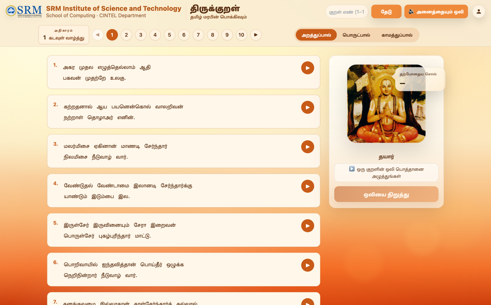
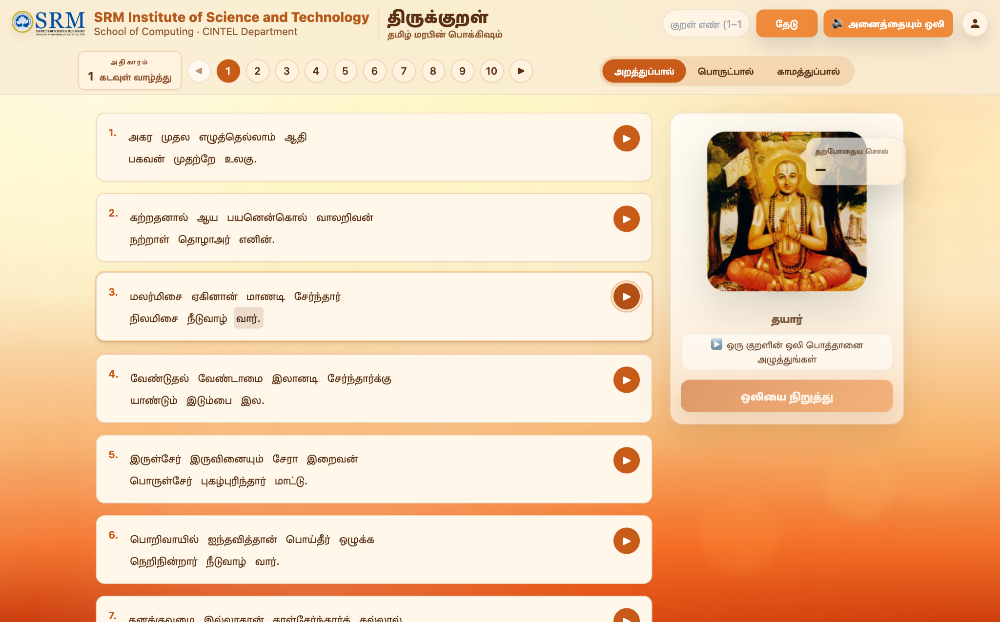

# திருக்குறள் — Thirukkural AI

[](https://github.com/S-Harshni/Thirukkural/actions/workflows/tests.yml)
[](https://s-harshni.github.io/Thirukkural/)
[](https://thirukkural-evaz.onrender.com)

All 1,330 couplets of the Thirukkural with three layers:

1. **Thirukkural AI** (`kuralai/`): multilingual **semantic search** (keyword BM25, dense multilingual embeddings and
   hybrid fusion, compared), a **grounded LLM tutor** that answers in English or Hindi citing only the couplets it was
   given and declines anything else (Tamil answers are the classical commentary itself), and **spoken questions**
   through Whisper. Open-source models on a laptop (Ollama: qwen2.5:3b, llama3.2:3b; intfloat/multilingual-e5-small).
2. **Measured**: 133 chapter-theme queries, 120 student questions in English and in Hindi and 30 off-topic
   questions, with retrieval, citation, refusal and language metrics.
3. **Reader app** (Flask): every couplet with Tamil commentary from five classical scholars, Tamil text-to-speech with
   live word highlighting, accounts.

**AI demo and results:** https://s-harshni.github.io/Thirukkural/ — keyword search over all couplets in the browser,
recorded tutor answers with audio, and the evaluation.
**Reader app:** https://thirukkural-evaz.onrender.com (free tier: the first request can take ~50 s to wake up).

## Thirukkural AI

```
question (typed, or spoken -> Whisper small) ──► dense multilingual search (e5-small) over all 1,330 couplets
   ──► top 3 couplets (Tamil text + English explanation + Tamil commentary)
   ──► tutor prompt (few-shot) ──► qwen2.5:3b ──► JSON {answer, cited, declined}
   ──► checks: every cited couplet was retrieved · answer in the asked language · off-topic declined
   ──► gTTS (English / Hindi / Tamil)
```

- **Search** ([`kuralai/search.py`](kuralai/search.py)): BM25 written from scratch over English, Tamil and Devanagari
  tokens; dense retrieval with `intfloat/multilingual-e5-small` (query/passage prefixes, normalised vectors); hybrid
  reciprocal-rank fusion. Chapter titles are kept **out** of the searched text, so a chapter-theme query has to match
  the meaning of the couplets, not the title.
- **Tutor** ([`kuralai/tutor.py`](kuralai/tutor.py)): zero-shot and few-shot prompts; strict JSON; citations must be
  among the retrieved couplets; refusal for anything not about the Thirukkural (including prompt-injection attempts).
  For Tamil the tutor returns the couplet and மு. வரதராசனார்'s commentary verbatim instead of generating Tamil with a 3B model.
- **Test set**: [`data/eval_questions.json`](data/eval_questions.json) — for 120 couplets sampled across all chapters,
  llama3.2:3b wrote the question a student might ask (the couplet it came from is the answer). The Hindi versions were
  translated separately, not by the models under test (their own Hindi translations were too poor to test with).
  30 off-topic questions in [`data/off_topic_questions.json`](data/off_topic_questions.json).
- **Voice** ([`kuralai/voice.py`](kuralai/voice.py), [`eval/eval_voice.py`](eval/eval_voice.py)): questions are
  synthesized, transcribed by Whisper (small, int8, CPU) and searched; retrieval from the transcript vs the typed question
  (`eval/eval_voice.py`; not yet run, so no voice numbers are reported here).

### Results

<!-- results -->
### Finding the right couplet (hit@5 / MRR@10)

| Search | Chapter themes (133) | Student questions, English (120) | Student questions, Hindi (120) |
|---|---:|---:|---:|
| Keywords (BM25) | 36.8% / 0.226 | 33.3% / 0.250 | 0.0% / 0.001 |
| Dense multilingual (e5-small) | 54.1% / 0.355 | 41.7% / 0.319 | 38.3% / 0.251 |
| Hybrid (rank fusion) | 40.6% / 0.302 | 41.7% / 0.316 | 11.7% / 0.068 |

### Grounded tutor (40 questions asked in English and in Hindi + 30 off-topic)

| Prompt · model | Cites the right couplet | …when it was retrieved | Declines off-topic | Citations valid | Right language | Valid JSON | p50 ms |
|---|---:|---:|---:|---:|---:|---:|---:|
| Zero-shot · qwen2.5 · 3b | 23.7% | 59.4% | 86.7% | 100.0% | 75.5% | 98.2% | 5,533 |
| Few-shot · qwen2.5 · 3b | 31.2% | 78.1% | 90.0% | 100.0% | 98.0% | 90.9% | 8,785 |
<!-- /results -->

**What the numbers say**

- **Dense multilingual search wins everywhere, and it is the only thing that works across languages.** Hindi questions
  share no words with the Tamil and English couplets: keyword search finds the right couplet 0% of the time, the e5
  model 38%. Fusing the two *hurts* Hindi (keyword noise outranks good dense hits), so the tutor uses dense search alone
  (chosen from this evaluation).
- Chapter themes are matched by meaning (titles are not in the searched text): dense search puts a couplet of the right
  chapter in the top 5 for 54% of the 133 themes.

### Run it

```bash
python3.11 -m venv .venv-ai && .venv-ai/bin/pip install -r requirements-ai.txt pytest ruff
ollama pull qwen2.5:3b && ollama pull llama3.2:3b
.venv-ai/bin/python ask.py "What does Valluvar say about friendship?"
.venv-ai/bin/python ask.py "दोस्ती के बारे में तिरुवल्लुवर क्या कहते हैं?" --lang hi
.venv-ai/bin/python ask.py --voice my_question.mp3
.venv-ai/bin/python eval/eval_retrieval.py && .venv-ai/bin/python eval/eval_tutor.py && .venv-ai/bin/python eval/eval_voice.py
.venv-ai/bin/python eval/report.py      # tables in this README
.venv-ai/bin/pytest -q                  # 7 tests, no model needed
```

## Reader app



| Kurals with commentary & audio | Word-by-word narration |
|---|---|
|  |  |

### Features

- **All 1330 kurals** across the three traditional sections (paals):
  அறத்துப்பால், பொருட்பால், காமத்துப்பால் — organized by iyal and chapter
  (அதிகாரம்), with global page numbers spanning the whole book.
- **Tamil commentary** for each kural, pulled from five classical
  commentators (சாலமன் பாப்பையா, மு. வரதராசனார், மு. கருணாநிதி, மணக்குடவர்,
  பரிமேலழகர்), plus the original English (V. V. S. Aiyar) translation and
  explanation as a fallback.
- **Text-to-speech playback** (Tamil, via gTTS) per kural or for a whole page
  at once, with a speaker panel that highlights the word currently being
  read.
- **Jump-to-kural search** — enter a kural number (1–1330) and it opens the
  right page, even if that kural lives in a different paal.
- **Accounts** — email/password signup and login, phone number + OTP login
  (logs the code to the console unless Twilio is configured), and Google
  OAuth login.
- **Audio caching** — generated speech is cached to disk by a hash of its
  text, so the same kural or page is never re-synthesized twice.

### Tech stack

| Layer     | Tech                                                          |
|-----------|----------------------------------------------------------------|
| Backend   | Flask 3, Flask-SQLAlchemy, Flask-Login, Flask-Migrate, Authlib |
| Database  | SQLite (local dev) / PostgreSQL (production)                  |
| Text-to-speech | gTTS (Google Translate TTS)                              |
| Frontend  | Server-rendered Jinja templates, Tailwind CSS (via CDN), vanilla JS |
| Production server | Gunicorn                                             |

### Project structure

```
tir/
├── app.py                        # Flask app: routes, auth, TTS, pagination
├── requirements.txt
├── Procfile                      # process command for deployment
├── start.sh                      # runs DB init, then Gunicorn
├── data/
│   ├── thirukkural.json          # all 1330 kurals (Tamil lines + English)
│   ├── thirukkural_meanings.json # Tamil commentary, keyed by kural number
│   └── detail.json               # paal → iyal → chapter structure
├── templates/                    # Jinja templates (base, landing, part, auth pages)
└── static/
    ├── app.js / part.js / landing.js
    ├── style.css / landing.css / animations.css
    └── audio/                    # generated TTS cache (git-ignored)
```

### Getting started

**Requirements:** Python 3.11+

```bash
git clone https://github.com/S-Harshni/Thirukkural.git
cd Thirukkural
python3 -m venv venv
source venv/bin/activate        # Windows: venv\Scripts\activate
pip install -r requirements.txt
```

Create the local SQLite database (only needed once, or after pulling schema
changes):

```bash
flask --app app init-db
```

Run the dev server:

```bash
python app.py
```

Open **http://127.0.0.1:5000**. Set `PORT` to run on a different port, and
`FLASK_DEBUG=1` to enable the reloader/debugger.

### Environment variables

All variables are optional for local development — the app falls back to
SQLite and logs OTP codes to the console instead of sending SMS.

| Variable | Purpose | Required for |
|---|---|---|
| `SECRET_KEY` | Flask session signing key | Production |
| `DATABASE_URL` | SQLAlchemy database URL (Postgres in production) | Production |
| `PORT` | Port the app listens on | Optional (default `5000`) |
| `FLASK_DEBUG` | Set to `1` to enable debug/reload mode | Local dev only |
| `GOOGLE_CLIENT_ID` / `GOOGLE_CLIENT_SECRET` | Google OAuth login | "Continue with Google" |
| `TWILIO_ACCOUNT_SID` / `TWILIO_AUTH_TOKEN` / `TWILIO_FROM` | Sending real SMS OTPs | Phone login in production |

### Routes

| Route | Method | Description |
|---|---|---|
| `/` | GET | Landing page — pick a paal |
| `/part/<paal>` | GET | Paginated kural list for a paal, supports `?page=`, `?search=` |
| `/speak` | POST | `{text, key}` → generates/serves cached TTS audio |
| `/login`, `/signup`, `/logout` | GET/POST | Email + password auth |
| `/auth/phone`, `/auth/phone/verify` | POST | Phone OTP login |
| `/auth/google`, `/auth/google/callback` | GET | Google OAuth login |
| `/profile`, `/settings` | GET | Account pages (login required) |
| `/api/auth/*` | POST/GET | JSON equivalents of the auth routes above |

### Deploying (Render)

Already deployed at https://thirukkural-evaz.onrender.com — a `thirukkural`
web service (free plan) and a `thirukkural-db` Postgres database (free plan,
**expires 2026-10-09 unless upgraded**), both auto-deploying from `main`.

To set this up from scratch, the app ships with a `Procfile` and `start.sh`
for Render (or any Heroku-style host):

1. Push this repo to GitHub.
2. In Render, create a new **Web Service** from the repo.
   - Build command: `pip install -r requirements.txt`
   - Start command: `./start.sh`
3. Add a PostgreSQL database in Render and copy its connection string.
4. Set environment variables on the web service:
   - `SECRET_KEY` — any long random value
   - `DATABASE_URL` — the Postgres connection string from step 3
   - Optionally `GOOGLE_CLIENT_ID` / `GOOGLE_CLIENT_SECRET` (set the OAuth
     redirect URI to `https://<your-domain>/auth/google/callback`)
   - Optionally `TWILIO_ACCOUNT_SID` / `TWILIO_AUTH_TOKEN` / `TWILIO_FROM`
5. Deploy. `start.sh` runs `flask init-db` before starting Gunicorn, so
   tables are created automatically on first boot.

**Do not use SQLite in production** — most cloud filesystems are ephemeral,
so `app.db` (and any accounts in it) can vanish on restart or redeploy.
Always set `DATABASE_URL` to a managed Postgres instance in production.

### Data sources

- `data/thirukkural.json` — kural text and English translation/explanation.
- `data/thirukkural_meanings.json` — Tamil commentary from five classical
  commentators, merged into each kural at startup as `explanation_ta`.
- `data/detail.json` — the paal → iyal (இயல்) → chapter (அதிகாரம்) hierarchy,
  used to label each page with its chapter and to compute page ranges.
